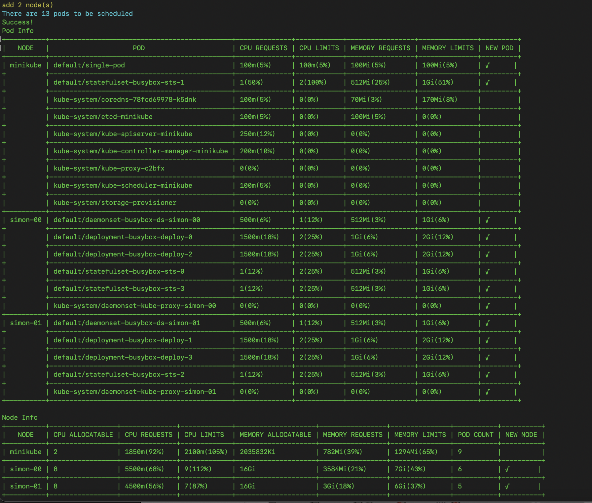

# Open-Simulator

[](https://goreportcard.com/report/github.com/alibaba/open-simulator)


English | [简体中文](./README_zh.md)

## Introduction

Open-simulator is **a cluster simulation component** serving to kubernetes cluster deployment. The core of open-simulator is that simulates the ability of **Kube-Controller-Manager** component to generate pod instances originating from [workload](https://kubernetes.io/zh/docs/concepts/workloads/) resources and the scheduling ability of **Kube-Scheduler** component to schedule pod based on scheduling policy to achieve the effect of simulating deployment in a real scenario. Eventually，users, quickly and clearly, can get a reasonable deployment plan or make it at your discretion according to the deployment

## Use Case

Open-simulator hopes to solve the thorny **capacity planning** problem in kubernetes:

- Calculate cluster size: calculate **the minimum number of nodes** on the condition of deploying successfully specific application according to the available machine specifications (such as CPU cores, memory and disks) and the files (a series of workloads config containing the specified number of duplicates, affinity policies and resource requests) to deploy your application;
- Simulate application deployment：in the running kubernetes cluster, simulate whether application can be successfully deployed. If the cluster size does not meet the deployment requirements, **a minimum cluster expansion proposal** is given to solve the All-or-Nothing problem of scheduling application;
- Offline idle node：in the running kubernetes cluster, filter and **offline the idle nodes** based on the custom rules.

Through reasonable **capacity planning**, users can reduce labor costs in the delivery phase and operation and maintenance costs after the delivery phase, and improve the overall utilization of cluster resources。

## ✅ Character

- [x] Support to create kubernetes clusters of any size you want
- [x] Support to deploy various workloads, including as follows:
  - [x] Deployment
  - [x] StatefulSet
  - [x] Daemonset
  - [x] Job
  - [x] CronJob
  - [x] Pod
- [x] Support to simulate Kube-Scheduler scheduling and reports the topology results of application deployment
- [x] Support the automatic addition of nodes to deploy successfully applications
- [x] Support storage scheduling of [Open-Local](https://github.com/alibaba/open-local)
- [x] Support helm chart
- [x] Support setting the average resource utilization
- [x] Support the custom sequence of deployment for multiple applications
- [ ] CR resource
- [ ] PV/PVC in the community
- [ ] Offline idle node

## 🚀 Quick start

### Build

```bash
mkdir -p $(GOPATH)/github.com/alibaba
cd $(GOPATH)/github.com/alibaba
git clone git@github.com:alibaba/open-simulator.git
cd open-simulator
make
```

### Run

```bash
# Interactive Mode
bin/simon apply -i -f example/simon-config.yaml
```

[example/simon-config.yaml](example/simon-config.yaml):

```yaml
apiVersion: simon/v1alpha1
kind: Config
metadata:
  name: simon-config
spec:
  # the file path to generate the initial cluster, select one of the following
  # cluster:
  #   customConfig: the path of the custom cluster
  #   kubeConfig: the path of the kube-config file in the real cluster
  cluster:
    customConfig: example/cluster/demo_1

  # list of applications to be deployed
  # support chart: a folder or package.
  # for multiple applications, configuration order as deployment order
  # appList:
  #   name: set name to distinguish conveniently applications
  #   path: the path of the application files
  #   chart: an omitempty field; If the value of chart is specified as true, it means that the application is a chart; If false or not specified, it is a non-chart
  appList:
    - name: yoda
      path: example/application/charts/yoda
      chart: true
    - name: simple
      path: example/application/simple
    - name: complicated
      path: example/application/complicate
    - name: open_local
      path: example/application/open_local
    - name: more_pods
      path: example/application/more_pods

  # the node file to automatically adjust the cluster size. The node specification can be specified arbitrarily according to the demand.
  # at present, only one node can be configured
  newNode: example/newnode
```

Results View



## License

[Apache 2.0 License](LICENSE)