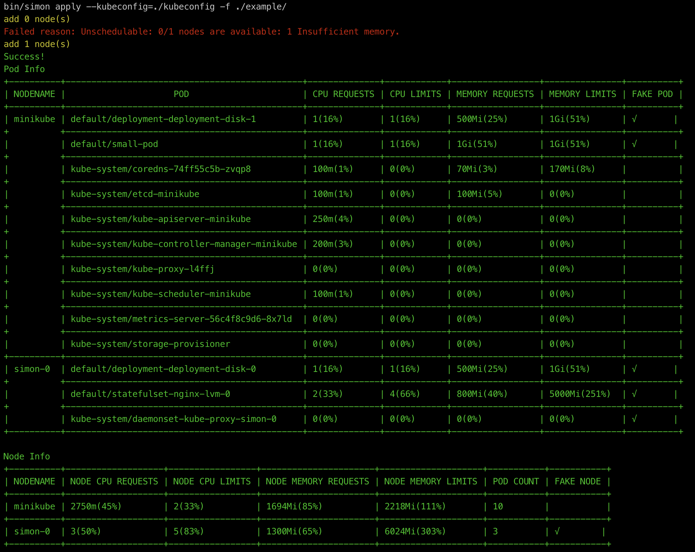

# Open-Simulator

[](https://goreportcard.com/report/github.com/alibaba/open-simulator)


## Motivation
### 概念定义

**Open-Simulator** 是 K8s 下的**仿真调度组件**。用户准备一批待创建 Workload 资源，Workload 资源指定好资源配额、绑核规则、亲和性规则、优先级等，通过 **Open-Simulator 的仿真调度能力**可判断当前集群是否能够满足 Workload 资源，以及添加多少资源可保证资源部署成功。

原生 Kubernetes 缺少**仿真调度能力**，且社区并没有相关项目供参考。**Open-Simulator** 可解决资源规划问题，通过Workload 调度要求计算出最少物理资源数量，进而提高资源使用率，为用户节省物理成本和运维成本。

## Use Case

两类场景需要资源规划：

- **交付前**：评估产品最少物理资源，通过仿真系统计算出交付需要的特定规格节点数量、磁盘数量（类似朱雀系统）；
- **运行时**：用户新建 or 扩容 Workload，仿真调度系统会给出当前集群物理资源是否满足，并给出集群扩容建议（详细到扩容节点数）

## Configuration File

open-simulator通过yaml配置文件来导入各种集群或者应用资源信息
```
apiVersion: simon/v1alpha1
kind: Config
metadata:
  name: simon-config
spec:
  cluster:
    customConfig: example/cluster/demo_1
  appList:
    - name: yoda
      path: example/application/charts/yoda
      chart: true
    - name: simple
      path: example/application/simple
    - name: complicated
      path: example/application/complicate
  newNode: example/node.yaml
```

### 文件三大板块：

- cluster: 指定集群信息
- appList: 指定需部署的应用信息
- newNode: 指定集群规模调整所需的Node信息

#### cluster

- customConfig: 自定义集群文件
- kubeConfig: 真实集群kube-config文件

以上两者只取其一

#### appList

文件类型:

- chart资源
- 非chart资源（yaml文件或文件夹）

资源类型:

- Deployment
- StatefulSet
- DaemonSet
- Job
- CronJob
- Physical Volume
- Physical Volume Claim
- ······

CR资源说明：由于CR资源行为存在不确定性，open-simulator暂时未支持CR资源。但我们计划制定一种CR资源规范，来消除其不确定性，从而达到支持的目的。

不同文件类型混合部署:

appList字段中可任意配置已支持的多种文件类型，并通过配置顺序来自定义你想要的调度顺序

#### newNode

节点规格可根据需求自定义配置，但只支持配置一种规格的Node节点

## Run

### 使用
#### 添加节点

执行命令

/bin/simon apply -f [仿真调度配置文件]

执行后输出一个名为configmap-simon.yaml的文件，用以保存结果。

```yaml
apiVersion: v1
kind: ConfigMap
metadata:
  name: simulator-plan
  namespace: kube-system
data:
  Deployment: '{"vivo-test-namespace/suppress-memcache-lsr":["simulator-node1","simulator-node1","node3","node2"],"vivo-test-namespace/suppress-memcache-be":["simulator-node1","simulator-node1","node3","node2"]}'
  StatefulSet: '{"vivo-test-namespace/suppress-memcache-lsr":["simulator-node1","simulator-node1","node3","node2"],"vivo-test-namespace/suppress-memcache-be":["simulator-node1","simulator-node1","node3","node2"]}'
```

### 效果图


## Deployment

> 以在 MacBook 上通过 Minikube 来模拟调度为例

### 步骤

```bash
# 克隆项目
mkdir $(GOPATH)/github.com/alibaba
cd $(GOPATH)/github.com/alibaba
git clone git@github.com:alibaba/open-simulator.git
cd open-simulator

# 安装minikube并运行
minikube start

# 拷贝 kubeconfig 文件到项目目录
cp ~/.kube/config  ./kubeconfig

# 编辑配置文件
apiVersion: simon/v1alpha1
kind: Config
metadata:
  name: simon-config
spec:
  cluster:
    customConfig: example/cluster/demo_1
  appList:
    - name: yoda
      path: example/application/charts/yoda
      chart: true
    - name: simple
      path: example/application/simple
    - name: complicated
      path: example/application/complicate
  newNode: example/node.yaml

# 项目编译及运行
make
bin/simon apply  -f example/simon-config.yaml
```
