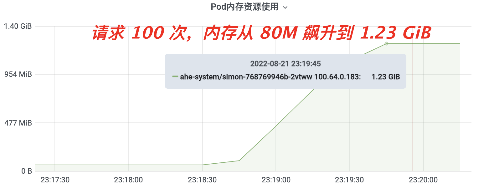
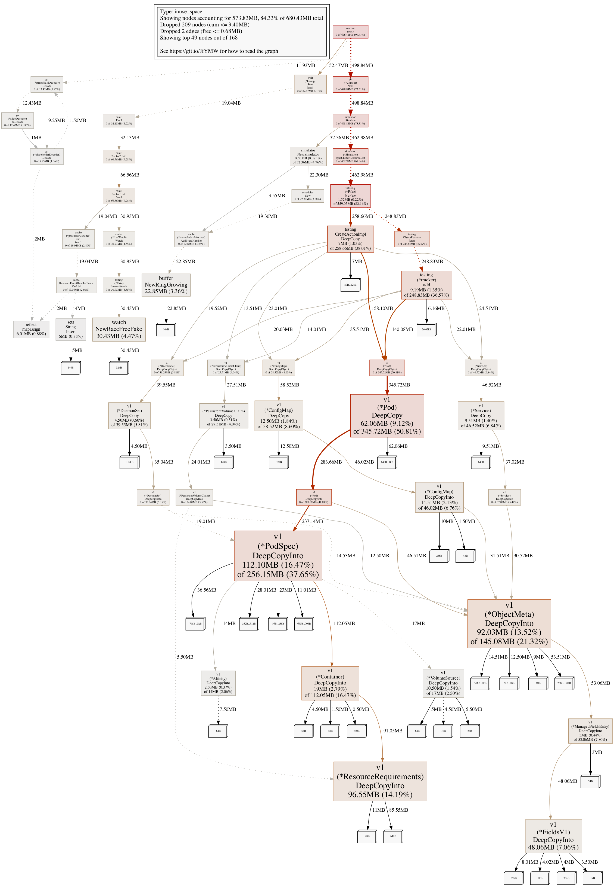
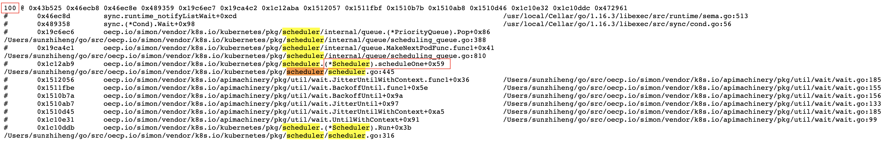

# 内存泄漏排查

测试大规模场景时（集群规模超过 3000 节点），发现 open-simulator 容器的内存随着外部 POST 请求数的增多而增高。在本地通过 [Postman](https://www.postman.com/) 工具连续发送 100 次请求后，问题复现。



Golang 有一套内存垃圾回收机制，go runtime 会定期扫描出没有被引用的内存块并对其进行清理，于是大胆怀疑 Golang 没有及时清理内存（想多了...）。经调研发现 Golang 内存自动清理机制包含两种：

- 内存分配量达到目标堆内存（Target heap memory）阈值：Target heap memory = Live heap + (Live heap + GC roots) * GOGC / 100，GC roots 包含 goroutine stacks 和 pointers in global variables，详见[链接](https://tip.golang.org/doc/gc-guide#GOGC)。
- 定时触发：默认 2分钟 触发一次，这个配置在 runtime/proc.go 里的 forcegcperiod 参数；

```go
// forcegcperiod is the maximum time in nanoseconds between garbage
// collections. If we go this long without a garbage collection, one
// is forced to run.
//
// This is a variable for testing purposes. It normally doesn't change.
var forcegcperiod int64 = 2 * 60 * 1e9
```

因为当前 1.23 GiB 内存已经远远超出测试前的内存，且之前每次调用内存都会升高，同时早已超过 2 分钟，内存不降代表必然存在内存泄漏。

Google 提供了 pprof 工具进行数据可视化分析统计（data profiling），可查看程序详细的内存堆（heap）和 GoRoutine 信息。



open-simulator 使用 [gin](https://gin-gonic.com/) 作为 HTTP web framework，gin 暴露 pprof 接口非常简单：

```go
package main

import (
    "net/http"

    "github.com/gin-contrib/pprof"
    "github.com/gin-gonic/gin"
)

func main() {
    app := gin.Default()

    pprof.Register(app)

    app.GET("/test", func(c *gin.Context) {
        c.String(http.StatusOK, "test")
    })
    app.Run(":3000")
}
```

执行 go tool pprof -png [地址url] 导出内存堆大小图


分析发现跟 Pod 资源的 DeepCopy 函数有关系。因为 golang 自己存在内存清理机制，那一定是程序中的 goroutine 出现“泄漏”导致内存无法回收。

通过 pprof 查看 goroutine 信息，发现了一个熟悉的函数 scheduleOne 。open-simulator 内部模拟社区 kube-scheduler 的调度就是以 vendor 形式引入 K8s 社区的 kube-scheduler 代码。每次执行模拟调度，simon 内部都会起一个 kube-scheduler goroutine，在执行完毕后该 goroutine 要退出且对应的 heap 会释放，这里没退出代表没有释放。发现在执行了 100 次后，该 goroutine 多出了 100 个，可拍板这里必然存在内存泄漏。



通过看 K8s 社区调度器源码，发现 goroutine 之所以没退出是因为 block 在 scheduleOne 函数的 NextPod 这里。

```go
// scheduleOne does the entire scheduling workflow for a single pod. It is serialized on the scheduling algorithm's host fitting.
func (sched *Scheduler) scheduleOne(ctx context.Context) {
	podInfo := sched.NextPod()
	// pod could be nil when schedulerQueue is closed
	if podInfo == nil || podInfo.Pod == nil {
		return
	}
    ...
}

```

因为该函数并没有与 kube-scheduler 使用同一个 context 上下文，故无法对其进行关闭。

```go
// NextPod should be a function that blocks until the next pod
// is available. We don't use a channel for this, because scheduling
// a pod may take some amount of time and we don't want pods to get
// stale while they sit in a channel.
NextPod func() *framework.QueuedPodInfo
```

无解，没有优雅退出的解决方式，那只能 hack！在对所有资源进行模拟调度并获取结果后，再创建一个 pod 使 NextPod 顺利执行，同时关闭调度器所使用的上下文（Context），详见 PR [#88](https://github.com/alibaba/open-simulator/pull/88)。

至此再无多余的 scheduleOne 协程，再次通过 pprof 工具，发现内存使用还是很高（没有下降多少），且 goroutine 总数依然很多。既然 kube-scheduler 所在协程退出了，那问题一定出在调用 scheduler 的外部。

继续研究通过 pprof 研究。发现 DeepCopy 函数依然占用了很大的 heap。

寻根溯源，根据 pprof 堆图定位在 syncClusterResourceList 函数。该函数内部使用 fake client （import "k8s.io/client-go/kubernetes/fake"）创建了一些 K8s 资源，难不成 fake client 会存在内存泄漏？

这里只有啃源码了。

通过看源码，定位到可能是 informer 方面的问题，于是想要提高日志等级来看。这里发现 klog 不好搞。

发现每次总有几个informer不会正常关闭。

设置了wait cache，发现正常了，但还是有，全局搜索，一次性找到根因。。

内存正常了。回收也正常了。但。。

goroutine依然很高。继续排查。。

发现原因是在一个 event broadcast 里，去掉！好了！（这里看下 stopeverything是否可以。试过后不行，只能接收。。。）
